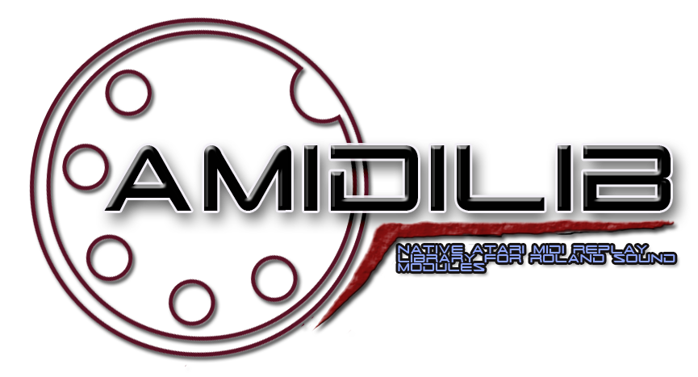

Introduction
------------

AMIDILIB is replay library which allows easy replay of MIDI files in various formats via external midi port found in all 16/32 bit [Atari home computers](https://en.wikipedia.org/wiki/Atari_ST). 
It supports General Midi instruments (GM1 / GM2) and Roland MT-32 family of synths. Main motivation behind this library was providing midi music replay in games and game ports.
 
Library can also preprocess various midi data and export them to custom binary format (nkt), which is more suitable for use in programs and games - 
data doesn't have to be preprocessed which decreases significantly loading times, it's smaller and it's easier to integrate with existing projects. 

Compilation from sources
------------------------

To compile library from sources following tools are needed:

* [SCons build tool](http://scons.org/)
* GCC cross compiler - [gcc 4.3.4](http://vincent.riviere.free.fr/soft/m68k-atari-mint/) or [gcc 7.x / 8.x (brownelf)](http://d-bug.mooo.com/beyondbrown/post/gcc7/)
* [VASM m68k cross compiler](http://sun.hasenbraten.de/vasm/)
* Environment like [Cygwin](https://www.cygwin.com/) under Windows or Linux.

Detailed information about building library are in [compilation instructions](compilation.md), basic integration steps with your own programs are in [integration](integration.md).

Currently there's no binary relases, but it might change in the future. Documentation and examples are also missing, but they will be provided at some point. 
Until then you can contact me: [nokturnal@nokturnal.pl](mailto:nokturnal@nokturnal.pl).

License
-------------------------
See [LICENSE](LICENSE.md)
